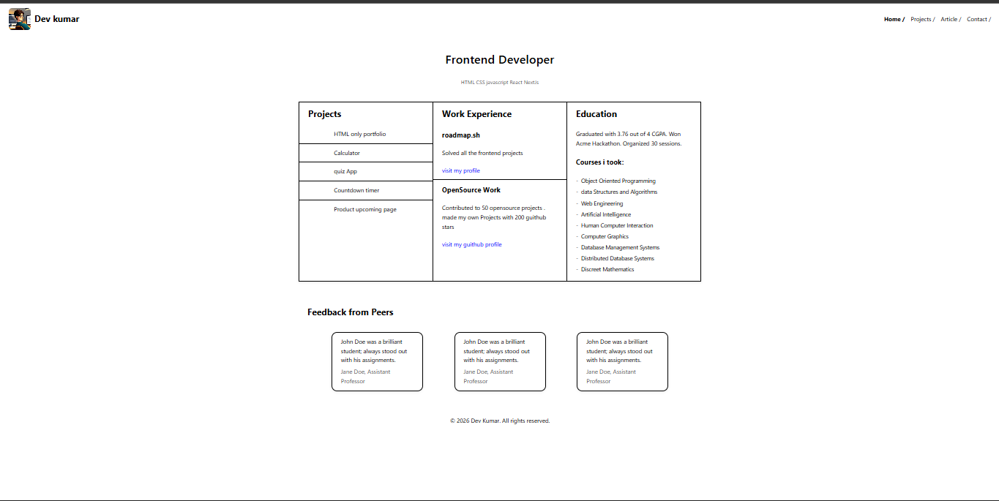
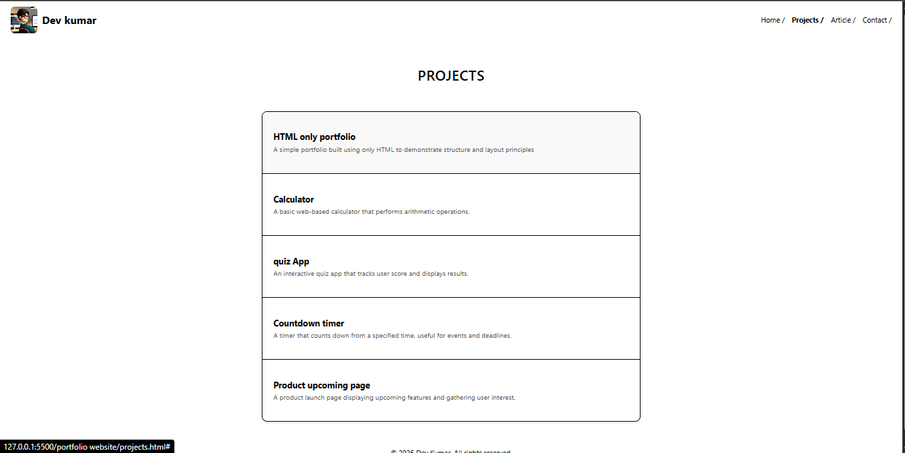
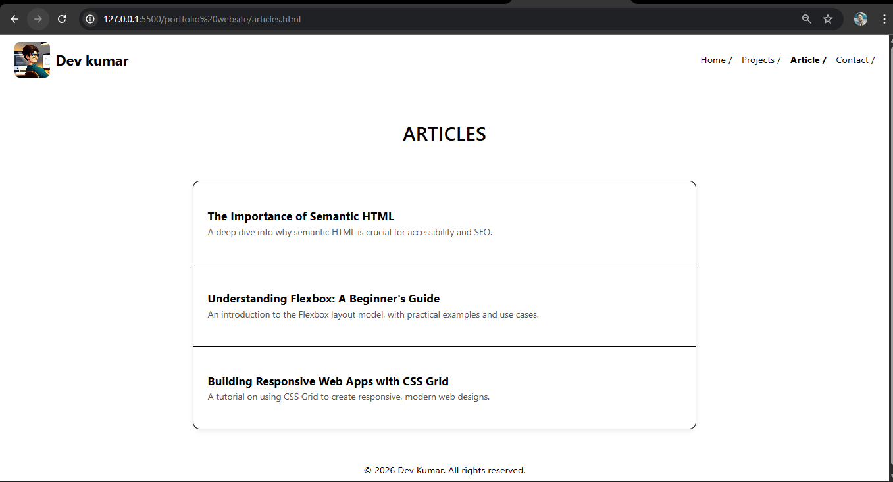
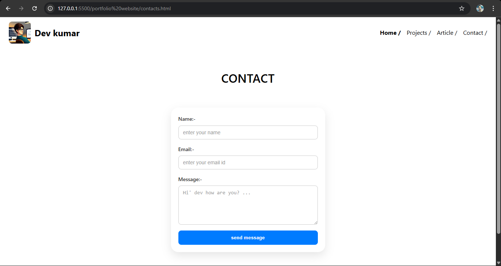

#  Personal Portfolio Website

A simple and responsive personal portfolio website built using **HTML and CSS**.
This project showcases my frontend skills, projects, and contact information.
---

This project is part of the **Frontend Developer roadmap projects from roadmap.sh**  https://roadmap.sh/projects/portfolio-website .

## Home page 

## Project

## article

## contact

Project Link:  
https://devkumar3631.github.io/portfolio-website-html-css-/
---

##  Pages Included

The website contains the following pages:

- **Home** – Introduction and overview
- **Projects** – List of personal projects
- **Articles** – Technical articles
- **Contact** – Contact form for users

## ⭐ Acknowledgement

This project is part of my learning journey in frontend development.

---

⭐ If you like this project, consider giving it a star!

