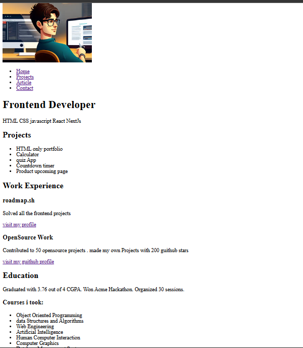
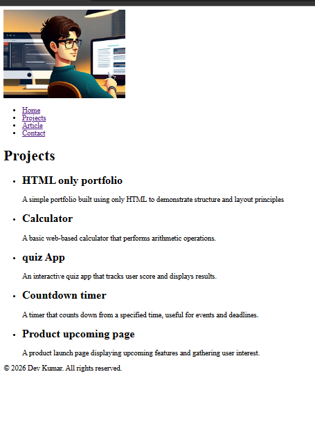
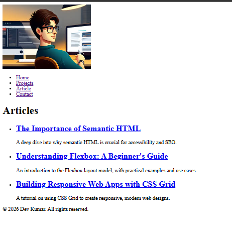
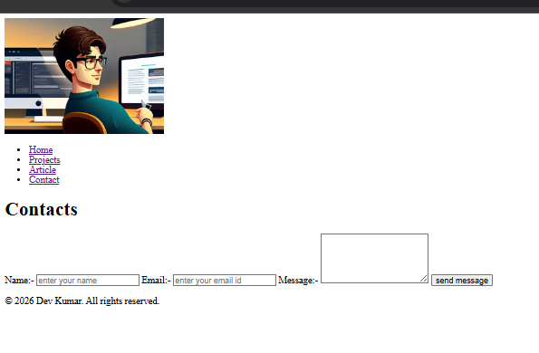

# Basic HTML Portfolio Website

This project is a **multi-page HTML-only website** built to practice **semantic HTML structure and website layout**.  
The goal of this project is to learn how to structure a website properly using HTML before adding styling with CSS.

This project is part of the **Frontend Developer roadmap projects from roadmap.sh**.

## Home page 

## Project

## article

## contact

Project Link:  
https://roadmap.sh/projects/basic-html-website
---

##  Pages Included

The website contains the following pages:

- **Home** – Introduction and overview
- **Projects** – List of personal projects
- **Articles** – Technical articles
- **Contact** – Contact form for users

